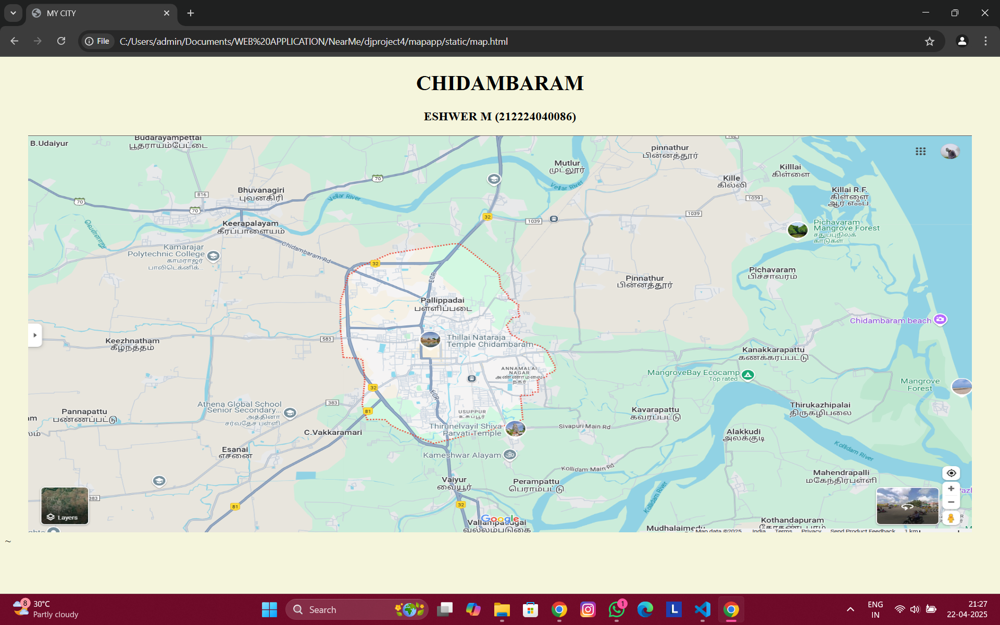

# Ex04 Places Around Me
## Date: 22.04.2025
## Name: ESHWER M
## Reg No: 212224040086

## AIM
To develop a website to display details about the places around my house.

## DESIGN STEPS

### STEP 1
Create a Django admin interface.

### STEP 2
Download your city map from Google.

### STEP 3
Using ```<map>``` tag name the map.

### STEP 4
Create clickable regions in the image using ```<area>``` tag.

### STEP 5
Write HTML programs for all the regions identified.

### STEP 6
Execute the programs and publish them.

## CODE
```
map.html

<!DOCTYPE html>
<html lang="en">
<head>
  <meta charset="UTF-8">
  <title>MY CITY</title>
</head>
<body bgcolor="beige">
  <h1 align="center"><b>CHIDAMBARAM</b></h1>
  <h3 align="center"><b>ESHWER M (212224040086)</b></h3>
  <center>
  
</center>
  <map name="mymap">
    <area shape="rect" coords="1725,213,1750,262" href="beach.html" alt="CHIDAMBARAM BEACH">
    <area shape="rect" coords="581,390,596,519" href="temple.html" alt=" THILLAI NATARAJA TEMPLE">
    <area shape="rect" coords="118,144,970,154" href="pichavaram.html" alt="PICHAVARAM MANGROVE FOREST">
    <area shape="rect" coords="1452,888,1542,869" href="school.html" alt="ATHENA GLOBAL SCHOOL">
    <area shape="rect" coords="1363,750,1558,813" href="river.html" alt="KOLLIDAM RIVER">
  </map>
</body>~
</html>

beach.html

<html>
  <head>
    <title>My Home Town</title>
  </head>
  <body bgcolor="blacK">
    <h1 align="center">
      <font color="beige"><b><u>CHIDAMBARAM</u></b></font>
    </h1>

    <h3 align="center">
      <font color="blue"><b>CHIDAMBARAM BEACH</b></font>
    </h3>

    <hr size="3" color="gold">

    <p align="justify">
      <font color="beige" face="Georgia" size="5">
        Chidambaram, a historic temple town in Tamil Nadu, is well-known for its cultural richness and spiritual heritage, especially the iconic Nataraja Temple. But just beyond its vibrant streets lies a hidden gem for nature lovers—Samiyar Pettai Beach, located around 23 kilometers from the town. This beach offers a calm and serene escape from the busy rhythms of urban life. With its golden sands, gentle waves, and clear skies, the beach paints a picture-perfect setting for relaxation. Locals and tourists alike come here to unwind, take long peaceful walks, enjoy the sea breeze, or simply watch the sun set over the horizon. The beach is relatively less commercialized, which adds to its untouched charm and makes it a great spot for solitude or a quiet outing with friends and family. Fishing is also a key activity here, with colorful boats lining the shore and fishermen going about their daily routine—a glimpse into the coastal life of Tamil Nadu. Whether you're a traveler seeking peace, a photographer looking for inspiration, or someone wanting a break from routine, Samiyar Pettai Beach near Chidambaram is a refreshing coastal retreat that shouldn't be missed.
      </font>
    </p>
  </body>
</html>

temple.html

<html>
  <head>
    <title>My Home Town</title>
  </head>
  <body bgcolor="blacK">
    <h1 align="center">
      <font color="beige"><b><u>CHIDAMBARAM</u></b></font>
    </h1>

    <h3 align="center">
      <font color="red"><b>THILLAI NATARAJ TEMPLE</b></font>
    </h3>

    <hr size="3" color="gold">

    <p align="justify">
      <font color="beige" face="Georgia" size="5">
        The Thillai Nataraja Temple in Chidambaram is one of the most sacred and architecturally magnificent temples in South India, dedicated to Lord Shiva in his unique form as Nataraja, the cosmic dancer. This ancient temple, believed to be over a thousand years old, stands as a shining symbol of Tamil spirituality, art, and culture. Unlike typical Shiva temples that house a lingam, the Thillai Nataraja Temple features a striking idol of Lord Shiva performing the Ananda Tandava—the Dance of Bliss—which represents the five cosmic activities: creation, preservation, destruction, concealment, and grace. The deity is enshrined in the Chit Sabha, a sanctum that symbolizes the heart and consciousness of all beings.

The temple complex itself spans about 40 acres, with grand gopurams (towering gateways) carved with scenes from mythology, intricate sculptures, and inscriptions in ancient Tamil and Sanskrit. The architecture is a glorious example of the Chola dynasty's contribution to art and temple building. One of the most spiritually significant aspects of the temple is the Akasha Lingam—an invisible representation of Shiva as the element of space (ākāśa)—making it one of the Pancha Bhoota Sthalams, the five temples representing the five elements of nature.

Thillai Nataraja Temple is not just a religious site but also a cultural hub, especially for classical dancers and musicians. It plays a vital role in the legacy of Bharatanatyam, as it is said that the dance form originated here and was once performed in the temple premises by devadasis. Every year, thousands of devotees and artists gather here for the Natyanjali Dance Festival, held during Maha Shivaratri, celebrating Lord Shiva through classical dance.
      </font>
    </p>
  </body>
</html>

pichavaram.html

<html>
  <head>
    <title>My Home Town</title>
  </head>
  <body bgcolor="blacK">
    <h1 align="center">
      <font color="beige"><b><u>CHIDAMBARAM</u></b></font>
    </h1>

    <h3 align="center">
      <font color="green"><b>PICHAVARAM MANGROVE FOREST</b></font>
    </h3>

    <hr size="3" color="gold">

    <p align="justify">
      <font color="beige" face="Georgia" size="5">
        The Pichavaram Mangrove Forest, located about 15 kilometers from Chidambaram in Tamil Nadu, is one of the largest and most enchanting mangrove ecosystems in India—and even the world. Sprawling across over 1,100 hectares, this unique forest is nestled between the Vellar and Coleroon river estuaries, forming a vast network of waterways, small islands, and dense mangrove trees. What makes Pichavaram truly special is its biodiversity and natural beauty. The forest is home to over 200 species of birds, numerous fish, crustaceans, and rare aquatic creatures, making it a haven for nature lovers and birdwatchers. Tourists can explore the forest through narrow water channels on boat rides, gliding under the canopy of thick mangrove roots—a surreal and almost magical experience. The peaceful ambiance, mirror-like waters, and the chirping of birds all around create a perfect escape from the noise of everyday life. Pichavaram is not only a scenic destination but also an ecological treasure, playing a vital role in protecting the coastline from erosion and acting as a natural barrier during cyclones and tsunamis. It’s a must-visit spot for anyone who wants to witness the raw beauty and quiet strength of nature.
      </font>
    </p>
  </body>
</html>

school.html

<html>
  <head>
    <title>My Home Town</title>
  </head>
  <body bgcolor="blacK">
    <h1 align="center">
      <font color="beige"><b><u>CHIDAMBARAM</u></b></font>
    </h1>

    <h3 align="center">
      <font color="red"><b>ATHENA GLOBAL SCHOOL</b></font>
    </h3>

    <hr size="3" color="gold">

    <p align="justify">
      <font color="beige" face="Georgia" size="5">
        Athena Global School in Chidambaram is a modern, forward-thinking educational institution that blends academic excellence with holistic development. Affiliated with the CBSE curriculum, the school offers quality education from kindergarten to higher grades, focusing on both intellectual and personal growth. With well-equipped classrooms, science and computer labs, a spacious library, and a strong emphasis on digital learning, Athena provides a vibrant and tech-friendly learning environment. The school encourages students to participate in various co-curricular and extracurricular activities like sports, music, art, and public speaking, helping them build confidence and all-round skills. Teachers at Athena are trained to follow innovative and student-friendly teaching methods that promote curiosity, creativity, and independent thinking. Located in a peaceful area of Chidambaram, the campus is clean, secure, and designed to inspire learning. Athena Global School stands out as a trusted institution for parents who seek a balanced and future-ready education for their children.
      </font>
    </p>
  </body>
</html>

river.html

<html>
  <head>
    <title>My Home Town</title>
  </head>
  <body bgcolor="blacK">
    <h1 align="center">
      <font color="beige"><b><u>CHIDAMBARAM</u></b></font>
    </h1>

    <h3 align="center">
      <font color="blue"><b>KOLLIDAM RIVER</b></font>
    </h3>

    <hr size="3" color="gold">

    <p align="justify">
      <font color="beige" face="Georgia" size="5">
        The Kollidam River, also known as Coleroon, is one of the important distributaries of the mighty Cauvery River in Tamil Nadu. Originating from the Grand Anicut (Kallanai) near Srirangam, the Kollidam branches off from the main Cauvery and flows eastward, eventually draining into the Bay of Bengal. Stretching over 150 kilometers, the river flows through several districts including Tiruchirappalli, Thanjavur, Cuddalore, and Chidambaram. It plays a crucial role in supporting agriculture along its banks, especially in the fertile delta regions, making it a lifeline for thousands of farmers. Apart from its agricultural value, the river holds cultural and historical significance too. During monsoons, the river swells with rainwater, creating a majestic and powerful flow, while in summer, its dry stretches are often used for sand mining and local transport. The scenic views of the Kollidam, especially near Chidambaram, offer a peaceful retreat for locals and visitors alike. It stands as a symbol of both nature’s grace and its strength, nourishing the land and the people who depend on it.


      </font>
    </p>
  </body>
</html>
```
## OUTPUT

.png>)
.png>)
.png>)
.png>)
.png>)

## RESULT
The program for implementing image maps using HTML is executed successfully.
